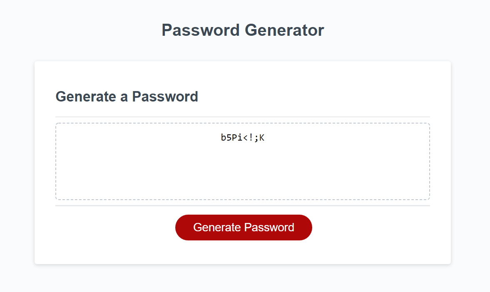

# Password Generator

## Description
This webpage allows a user to generate a random password based on the user's selections. It asks for their desired length, and whether or not they would like to includes special characters, numbers, lowercase letters, and uppercase letters. Their new password will then be displayed.

It checks that the length must be an integer, greater than 8 but less than 128, and not empty. The user's character choices (being either true or false) are stored in an array and a string is formed based on these choices. A new password will then be generated by randomly selecting characters in the string.

To view the web page visit this [link](https://mushymane.github.io/pw-generator/)

## Preview


## Technologies Used
- HTML - used to structure and create elements on the DOM
- CSS - styles the HTML elements on page
- JavaScript - provides the site's functionality
- Git - version control
- Github - where the repository is hosted
- Visual Studio Code - text editor

## Code Snippet
JavaScript code that generates a random password
```
for (let i = 0; i < length; i++) {
    var randomNumber = Math.floor(Math.random() * chars.length);
    password += chars.substring(randomNumber, randomNumber + 1);
  }
```

## Author Links
[LinkedIn](https://www.linkedin.com/in/luigilantin/)
[Github](https://github.com/mushymane)